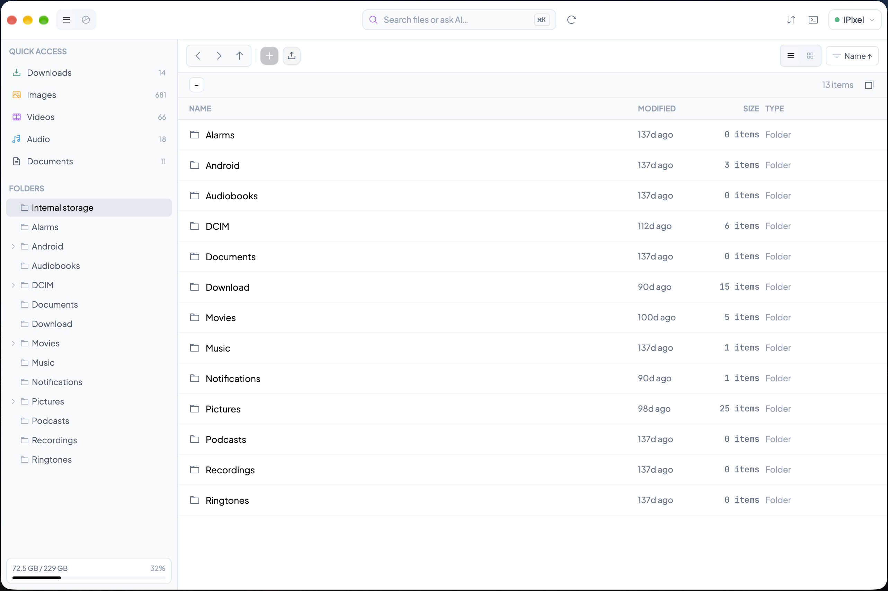
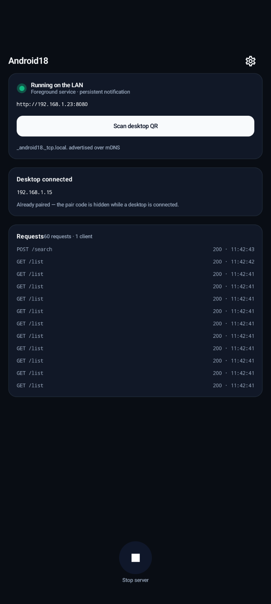
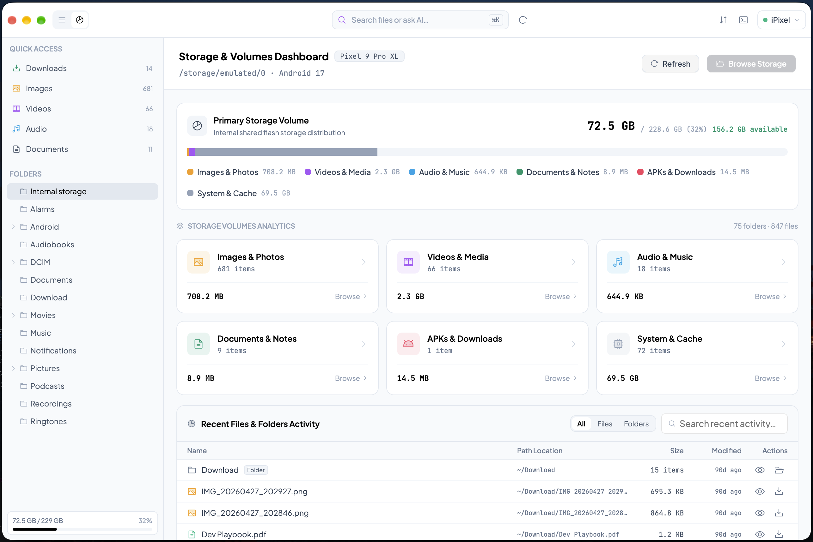
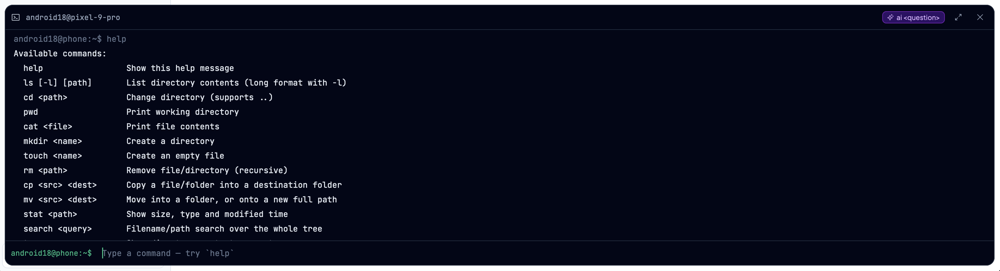
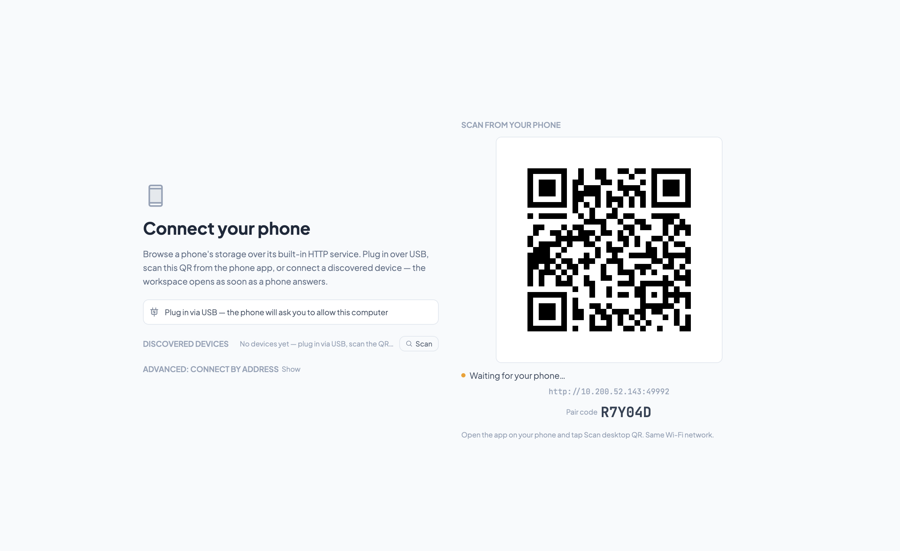

<p align="center">
  
</p>

<h1 align="center">Android18</h1>

<p align="center">
  <strong>Your Android phone's files, native on your Mac.</strong><br />
  No cloud, no accounts, no “Android File Transfer could not connect” — a fast,
  keyboard-driven macOS app talking straight to your phone over USB or Wi-Fi.
</p>

<p align="center">
  <a href="LICENSE"></a>
  
  
  
  
  <a href="CONTRIBUTING.md"></a>
</p>


<table>
  <tr>
    <td width="72%"></td>
    <td width="28%"></td>
  </tr>
  <tr>
    <td align="center"><sub>Android18 on the Mac</sub></td>
    <td align="center"><sub>The companion app on the phone</sub></td>
  </tr>
</table>

## Why

Getting files off an Android phone on a Mac is still oddly painful.
Android File Transfer was abandoned years ago, MTP clients work until they
suddenly don't, and "just upload it to Drive" is not an answer when the file
is 8 GB.

Android18 takes a different route. A tiny companion app on the phone runs a
file service — *on your phone, in your LAN* — and a native macOS client
talks to it over USB or Wi-Fi. Your files never touch anyone's cloud.

- **Native & fast** — a real macOS app (menu bar, ⌘ shortcuts, Finder-style
  grid) built in Rust on [GPUI Kit](https://gpui-kit.com) and Metal. No
  Electron anywhere.
- **Private by design** — pairing works like ADB: the phone asks before
  anything connects, and it can revoke you at any time.
- **Search that understands you** — ask for "camera photos" or "large
  files" in plain language. Runs offline on heuristics; add a Gemini key
  and it upgrades to Gemini 2.0 Flash.

## Try it in one command

```bash
make run
```

The app launches immediately in **demo mode** — a realistic in-process mock
phone, so every surface (browser, dashboard, AI search, terminal,
transfers) works with zero hardware. Pair a real phone later and the exact
same UI switches to live data.

**Requirements:** macOS, and [Rust](https://rustup.rs) — the pinned 1.95
toolchain installs itself on first use. The companion Android app is only
needed for a real phone.

<details>
<summary>What <code>make run</code> does under the hood</summary>

It starts a dependency-free watch loop (`scripts/dev.sh`): rebuild and
relaunch on save. The binary is launched from a generated dev `.app`
bundle, so the Dock, ⌘-Tab and Stage Manager all show the real app icon,
and the bundle is re-signed with your local code-signing identity when one
exists. (A plain `cargo run -p android18-app` still works as a one-shot,
minus the bundle niceties.)

</details>

## What's inside

- 🗂 **Files** — table and Finder-style grid views with breadcrumbs, sort,
  and history; right-click context menus; multi-select batch actions;
  per-row downloads; an inspector with text/image previews. Directories
  first, always.
- 🔎 **AI search (⌘K)** — plain-language queries ("camera photos", "large
  files") with explained matches and confidence pills; clicking a hit
  reveals the file in the browser.
- 📊 **Dashboard (⇧⌘D)** — storage volumes with used/total/available, six
  category cards that jump straight to their folders, and a searchable
  recents table with All/Files/Folders tabs.
- ⌨️ **Terminal (⌘\`)** — a dark REPL for your phone: `ls`, `cd`, `tree`,
  `cat`, `mkdir`, `rm`, `mv`, and `ai <query>` from the same search engine.
- ⬇️ **Transfers (⇧⌘T)** — a drawer driven by a proper transfer state
  machine: live progress, speed, pause/resume/cancel.
- 🍎 **Native polish** — a real menu bar, a keyboard-first flow, About and
  Settings modals, and a connect screen that gets out of the way the
  moment a phone is live.

<details>
<summary>More screenshots</summary>
<!-- Optional gallery — images render as soon as these land in assets/. -->



</details>

## Pairing a real phone

One rule: **the phone always asks — or you type its code.**

Build and install the companion app (`make install-apk`, or `make apk` for
a signed APK), open it and grant **All files access**. Then connect
whichever way is closest:

- 🔌 **USB** — plug the phone in (USB debugging on). The phone asks
  **Allow this computer?**. Allow, and you're connected.
- 📷 **QR code** — tap **Scan desktop QR** in the phone app and point it at
  the desktop's connect screen. Same prompt on the phone.
- 🔢 **Pair code** — press ▶ on the phone's Server screen; it shows a
  6-character code (e.g. `0X1D8C`). The desktop finds the phone via mDNS —
  type the code and you're in.

The fine print: codes are single-use, rotate every 10 minutes, and lock for
30 s after five wrong guesses (obvious look-alikes like `O`/`0` and
`I`/`1`/`L` are forgiven). If the Wi-Fi flaps or the laptop wakes from
sleep, the QR rebinds with a fresh code within seconds. Networks that block
mDNS can use *Advanced → connect by address*.

## Security & privacy

- **The phone asks first.** Nothing pairs — USB included — without an
  explicit *Allow this computer?* on the phone.
- **Codes, not passwords.** Single-use 6-character codes that rotate every
  10 minutes and lock after bad guesses.
- **One secret, tightly kept.** The pairing token lives in an owner-only
  (`0600`) state file — the same trust posture as ADB's own key. Nothing in
  the keychain, nothing in the cloud.
- **Revocable, always.** *Settings → Security → Revoke desktop access* on
  the phone rotates the token; revoked desktops get plain 401s until they
  pair again.

## AI search

⌘K accepts natural language and explains its matches. Out of the box it
runs entirely offline on heuristics; paste a Gemini API key into the phone
app and it upgrades to Gemini 2.0 Flash — same UI, smarter answers.

## Keyboard

| Shortcut | Action |
| --- | --- |
| `⌘K` | AI search |
| `⌘L` | Phone connection sheet (connected device) |
| `⌘[` / `⌘]` | Back / forward |
| `⌘↑` | Navigate up one directory |
| `⌘R` | Refresh listing |
| `⌘G` | Toggle table/grid view |
| `⇧⌘S` | Cycle sort field |
| `⇧⌘D` | Files ↔ Dashboard |
| `⌘\`` | Terminal overlay |
| `⇧⌘T` | Transfers drawer |
| `⌘I` | Inspector |
| `Esc` | Dismiss topmost layer |
| `⌘Q` | Quit |

## Build a release

```bash
make dmg    # → dist/Android18.app + dist/Android18-<version>.dmg
```

The DMG is themed (Retina background, pre-arranged `/Applications` drop
target) and signed — ad-hoc when the machine has no certificate, so it
opens fine on your own Macs. The build itself launches nothing.

<details>
<summary>Handing the DMG to other people (signing &amp; notarization)</summary>

Gatekeeper rejects anything below a *Developer ID* certificate on Macs that
aren't yours (recipients can still right-click → *Open* once). With a
Developer ID identity and a stored notarytool profile
(`xcrun notarytool store-credentials android18`), set
`ANDROID18_NOTARIZE=1` and the build submits, waits on, and staples the
DMG. A local identity — `ANDROID18_SIGN_IDENTITY`, else Developer ID, else
any codesigning identity — is used for the app signature automatically.

</details>

## Under the hood

One hard rule: the domain core never touches UI.

```
crates/core       GPUI-free domain core — types, paths, mock device, search,
                  shell, transfers. Fully unit-tested.
crates/transport  Real-device plumbing — HTTP backend, pairing, mDNS + adb
                  discovery, owner-only state file.
crates/app        The macOS app — GPUI Kit UI, one module per surface.
android-service/  Kotlin companion (Compose) — Ktor file server, pairing
                  UI, mDNS advertisement, Gemini search.
docs/             Design docs, architecture, UI migration map.
scripts/          Dev loop, DMG/APK packaging, icon builders.
```

The full picture — including the ports & adapters that keep the mock and
the real phone byte-compatible — is in
[docs/ARCHITECTURE.md](docs/ARCHITECTURE.md).

## Developing

```bash
make test    # Rust + Android unit tests

cargo fmt --all                                          # zero diff
cargo clippy --workspace --all-targets -- -D warnings    # zero warnings
cargo test --workspace                                   # all green
```

All three must pass before a change is "done". See
[CONTRIBUTING.md](CONTRIBUTING.md) for setup, layout, and PR expectations.

## Credits & license

Built with [GPUI Kit](https://gpui-kit.com) ·
[Phosphor Icons](https://phosphoricons.com) · [Ktor](https://ktor.io) ·
Plus Jakarta Sans & JetBrains Mono · optional search by
[Google Gemini 2.0 Flash](https://ai.google.dev).

Apache-2.0 — see [LICENSE](LICENSE). Stars and PRs welcome!


